# 1. 朝ラッシュ

## 壁の配置

## aw:無作為に壁

10\*10 の壁をいろんなところに置く

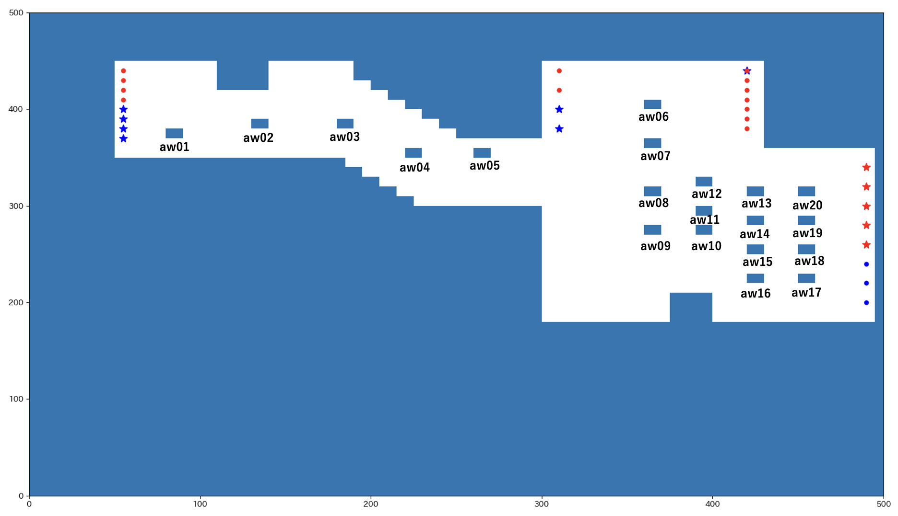

## aww:無作為に壁 2

### wall01

最大人口密度に 10\*10 の壁

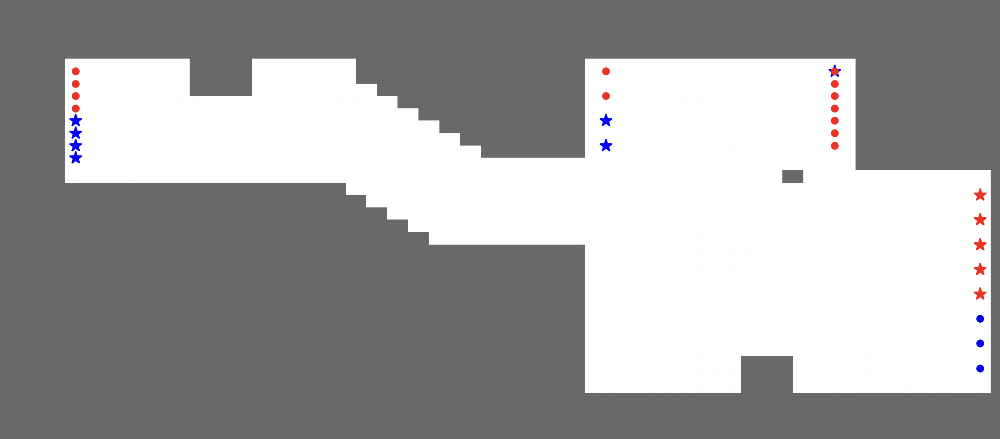

### wall02

最大人口密度に 5\*20 の壁

### wall03

wall02 を左に 10 移動させた

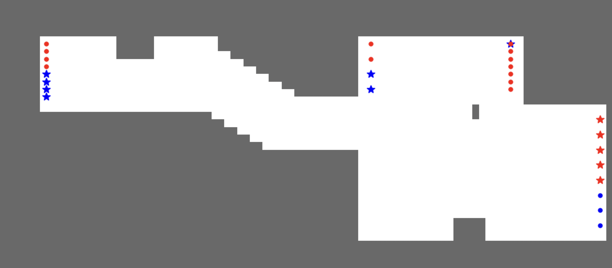

### wall04

最大人口密度に 20\*5 の壁

### wall05

wall04 を下に-5 移動

### wall06

20\*5 の壁
目視で人の流れの境目に配置

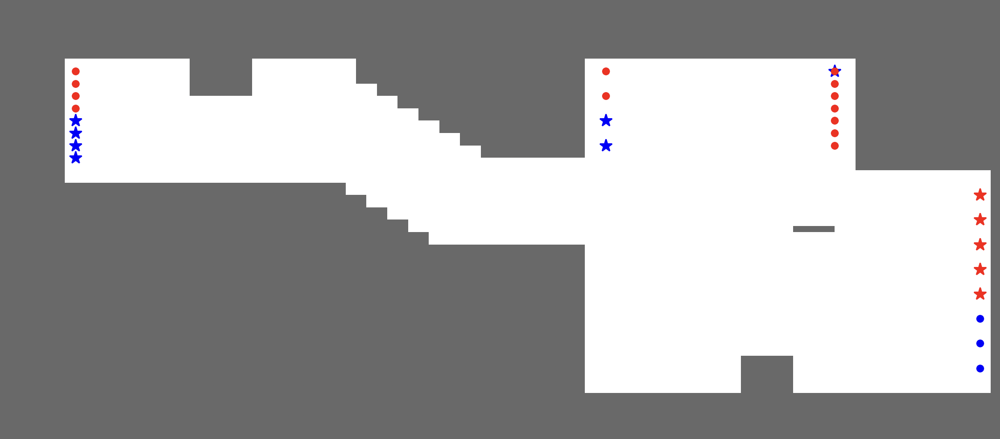

### wall07

20\*5
wall06 を左に 10 移動

### wall08

30\*5
wall06 と wall07 をつなげる

### wall09

淵野辺民とワーカーの改札の境目の延長に壁を配置
20\*5

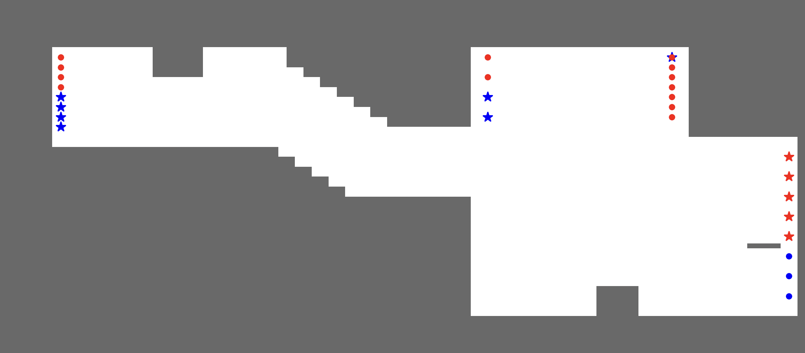

### wall10

wall09 をもっと伸ばしてみる
50\*5

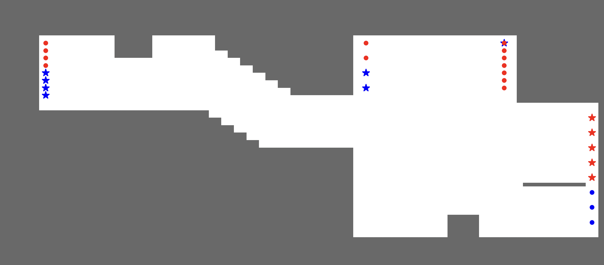

### wall11

wall09 をもっともっと伸ばしてみる
100\*5

### wall12

同様の考えで位置、長さを少し変更
40\*5

### wall13

奥階段の淵野辺民・ワーカーの分け目に壁
30\*5

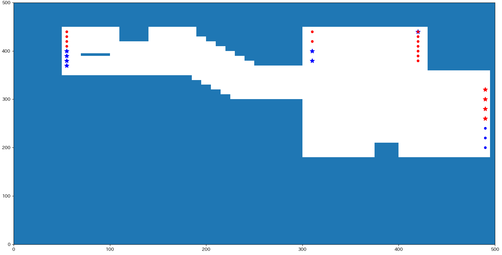

### wall14

トイレ付近に壁
20\*5

### wall15

淵野辺民奥階段とワーカーが密集する地点に壁
20\*20

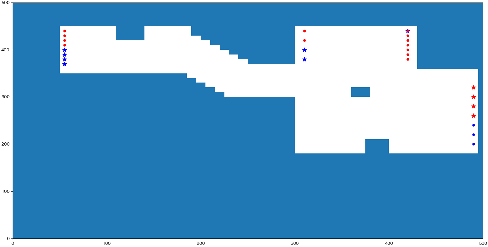

### wall16

wall15 の小さい版
10\*10

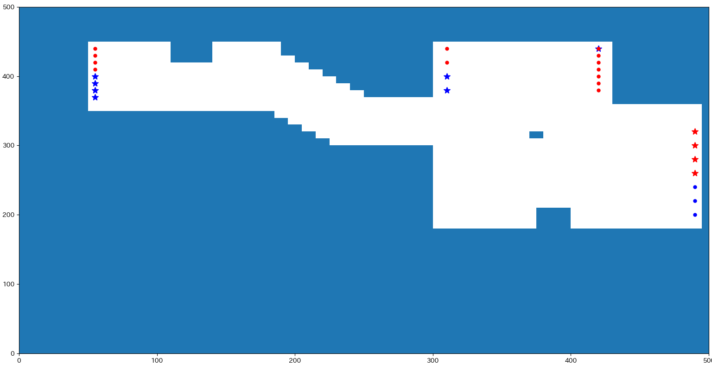

### wall17

エスカレーターから出てくるワーカー、直進できないように配置
5\*50

## 制限

### a01

淵野辺民の目的地を奥階段のみに制限

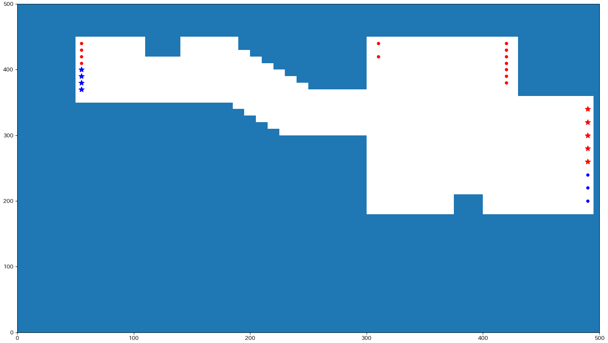

### a02

エスカレーターを上り only に制限(駅員さん案)

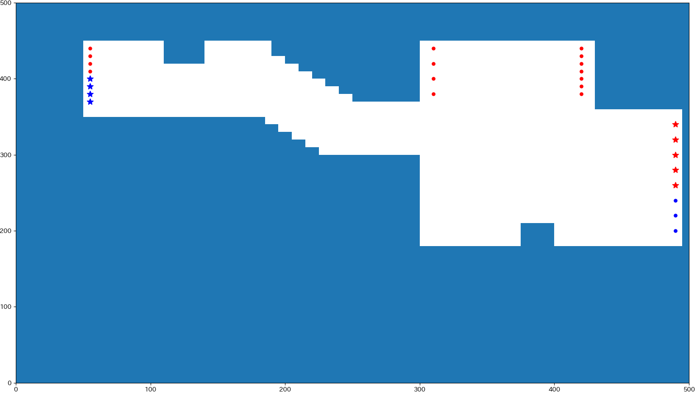

### a03

エスカレーターを下り only に制限

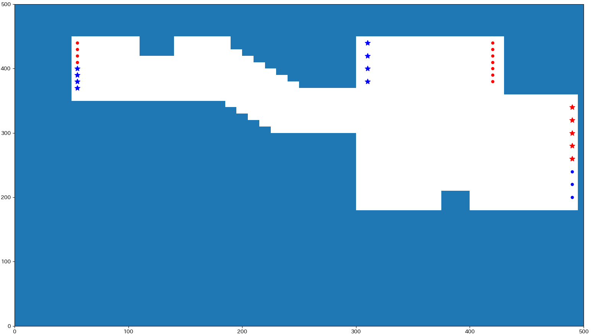

## 改札の改良

通行可能な改札（default 淵野辺民 3, ワーカー 5）

### b01

ワーカーを増やし、淵野辺民を減らす
淵野辺民 2, ワーカー 6

### b02

淵野辺民 1, ワーカー 7

### b03

両方通れる改札を考慮
淵野辺民 3, ワーカー 6, 下から 3 つ目が双方向

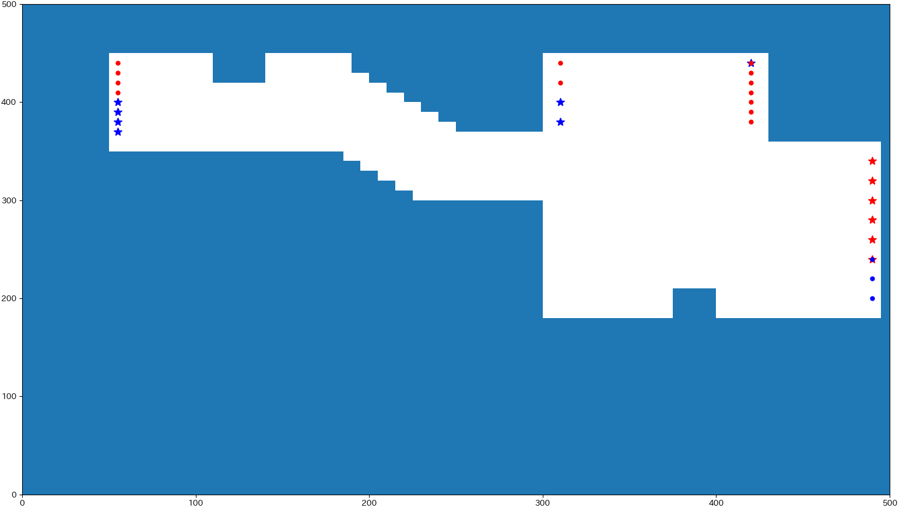

### b04

両方通れる改札を考慮
淵野辺民 2, ワーカー 7, 下から 2 つ目が双方向

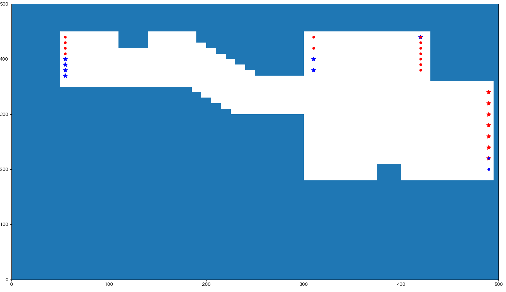

### b05

両方通れる改札を考慮
淵野辺民 3, ワーカー 7, 下から 2, 3 つ目が双方向

### b06

逆に淵野辺民の改札一つ増やしてみる
淵野辺民 4, ワーカー 4

