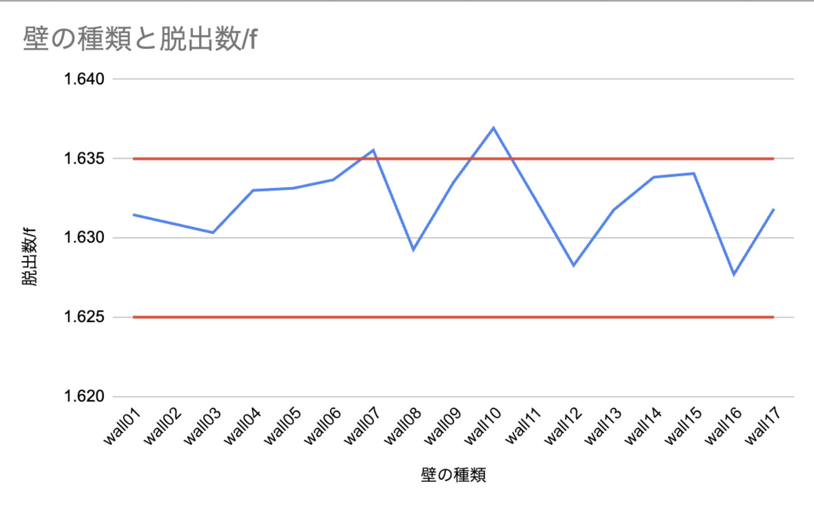

# 構成 v1

> [!NOTE]  
> 混雑緩和に有効である = 脱出数が上がった とする

用語

- 最大人口密度: 駅構内を 2500 分割した時の、最も多い足跡の数

## 結論（言いたいこと）

- 乗客同士の交錯を避けるように 壁を配置する/施策をとる と混雑緩和に有効である
- 置いたことで交錯を避けと言えない壁も見つかった（理由不明:交錯避けるではない）

## 結果として見せる図

混雑が緩和された壁の紹介

##### walls の軽い紹介

walls はこのような意図で置いた壁たちです。

1. 最大人口密度を塞ぐように置いた壁
1. 目視で確認した人の流れの境目においた壁
1. 乗る人と降りる人の改札の境目を延長するようおいた壁

