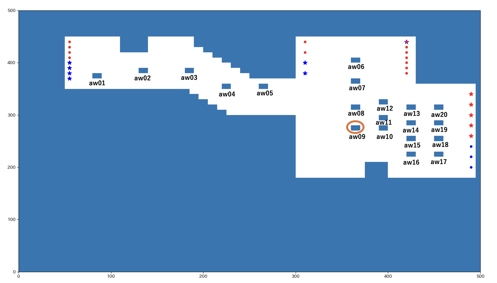
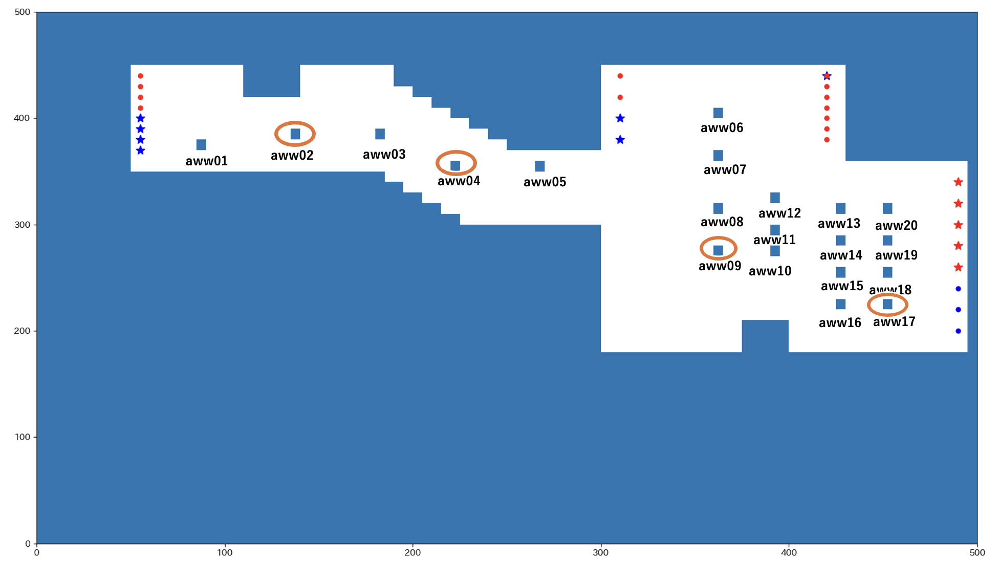
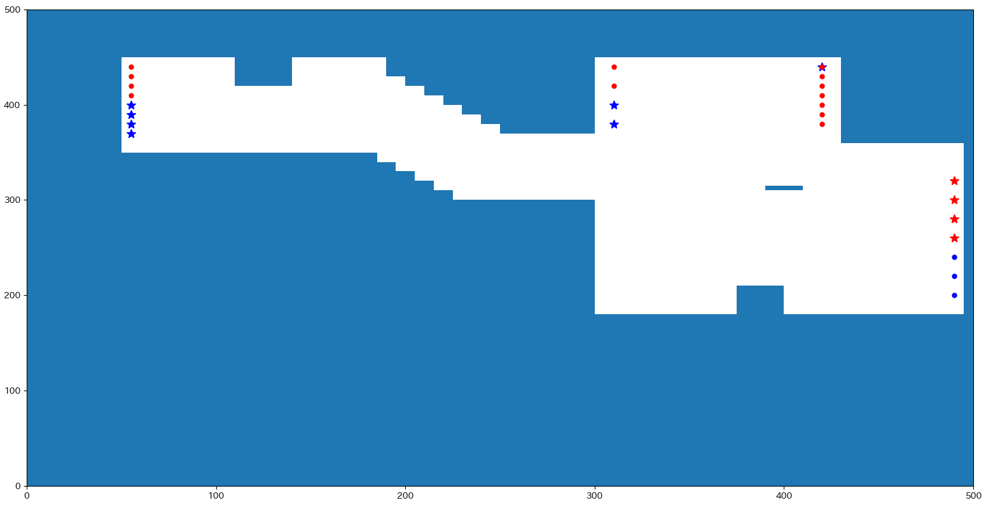

# 脱出数/f の上がった壁

#### [normal](https://github.com/kpab/plottingResult/blob/main/result_morning/normal/heatmap.png)

## aw

[aw09](https://github.com/kpab/plottingResult/tree/main/result_morning/aw09)

## aww

[aww02](https://github.com/kpab/plottingResult/tree/main/result_morning/aww02)
[aww04](https://github.com/kpab/plottingResult/tree/main/result_morning/aww04)
[aww09](https://github.com/kpab/plottingResult/tree/main/result_morning/aww09)
[aww17](https://github.com/kpab/plottingResult/tree/main/result_morning/aww17)

## wall

### wall07

最も混雑した地点に流れる人を制限するように置いた壁

[wall07](https://github.com/kpab/plottingResult/tree/main/result_morning/wall07)

### wall10

改札の進行方向を基準に、流れを分断するように置いた壁

[wall10](https://github.com/kpab/plottingResult/tree/main/result_morning/wall10)
